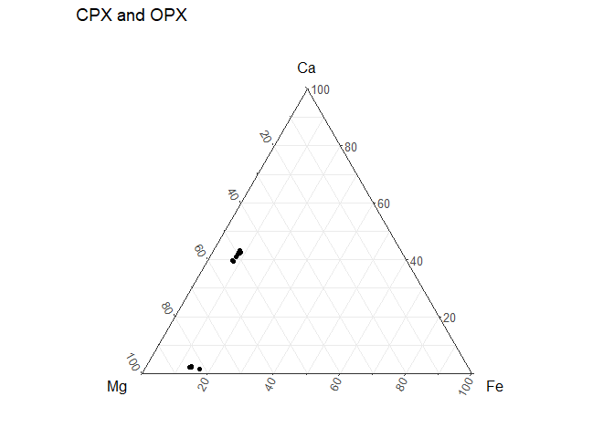
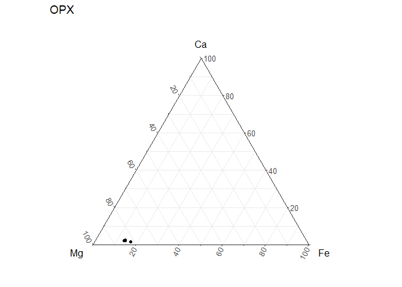
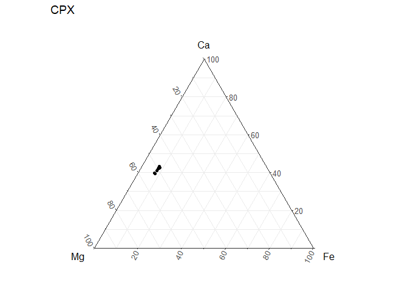

KBH\_94\_23\_DE\_5\_all\_pyx\_lines
================

## Both CPX and OPX are included

Line 1 OPX Line 3 CPX Line 4 OPX Line OPX Line 5 OPX/CPX/OPX

### Line 5

is a tiny CPX inside of a larger OPX


\#Bring in the CSV

## 

Not working %&gt;% filter(!is.na(phos\_ox))

# Ternary of both OPX and CPX:

``` r
MgO_num <- mutate(M5_DE_all_pyx_KBH_94_23, mg_dat = MgO/40.304,
                  fe_dat = FeO/71.844,
                  ca_dat = CaO/56.077,
                  Mg = (mg_dat/(mg_dat+fe_dat+ca_dat))*100,
                  Fe = (fe_dat/(mg_dat+fe_dat+ca_dat))*100,
                  Ca = (ca_dat/(mg_dat+fe_dat+ca_dat))*100
                  ) 
show_tbl_1 <- knitr::kable(MgO_num)#%>%
   #kable_material(c("striped", "hover"))
  #kable_styling()
  #kable_styling(font_size = 7)
  #kable_styling(latex_options="scale_down")
show_tbl_1
```

| OPX    | P2O5 |   SiO2 |  TiO2 | Al2O3 | Cr2O3 |    MgO |    CaO |   MnO |    FeO | NiO |  Na2O |   K2O |   mg\_dat |   fe\_dat |   ca\_dat |       Mg |        Fe |        Ca |
|:-------|-----:|-------:|------:|------:|------:|-------:|-------:|------:|-------:|----:|------:|------:|----------:|----------:|----------:|---------:|----------:|----------:|
| 1.1    |    0 | 52.856 | 0.241 | 5.803 | 0.359 | 30.472 |  1.166 | 0.138 |  8.740 |   0 | 0.134 | 0.009 | 0.7560540 | 0.1216525 | 0.0207928 | 84.14631 | 13.539518 |  2.314174 |
| 1.2    |    0 | 53.478 | 0.222 | 5.786 | 0.401 | 30.686 |  1.172 | 0.184 |  8.753 |   0 | 0.122 | 0.003 | 0.7613636 | 0.1218334 | 0.0208998 | 84.21262 | 13.475704 |  2.311681 |
| 1.3    |    0 | 53.457 | 0.226 | 5.678 | 0.403 | 30.807 |  1.133 | 0.182 |  8.847 |   0 | 0.142 | 0.000 | 0.7643658 | 0.1231418 | 0.0202044 | 84.20797 | 13.566176 |  2.225856 |
| 1.4    |    0 | 53.029 | 0.223 | 5.569 | 0.409 | 30.364 |  1.132 | 0.178 |  8.758 |   0 | 0.123 | 0.001 | 0.7533744 | 0.1219030 | 0.0201865 | 84.13230 | 13.613392 |  2.254310 |
| 1.5    |    0 | 53.688 | 0.190 | 5.548 | 0.410 | 30.993 |  1.133 | 0.188 |  8.806 |   0 | 0.140 | 0.000 | 0.7689807 | 0.1225711 | 0.0202044 | 84.34061 | 13.443410 |  2.215983 |
| 1.6    |    0 | 53.717 | 0.188 | 5.466 | 0.403 | 30.922 |  1.131 | 0.158 |  8.783 |   0 | 0.114 | 0.006 | 0.7672191 | 0.1222510 | 0.0201687 | 84.34327 | 13.439509 |  2.217220 |
| 1.7    |    0 | 53.728 | 0.218 | 5.446 | 0.437 | 30.982 |  1.094 | 0.166 |  8.770 |   0 | 0.127 | 0.006 | 0.7687078 | 0.1220700 | 0.0195089 | 84.44678 | 13.410065 |  2.143159 |
| 1.8    |    0 | 53.836 | 0.203 | 5.507 | 0.407 | 30.894 |  1.144 | 0.193 |  8.755 |   0 | 0.120 | 0.000 | 0.7665244 | 0.1218613 | 0.0204005 | 84.34596 | 13.409233 |  2.244810 |
| 1.9    |    0 | 53.026 | 0.216 | 5.347 | 0.426 | 30.581 |  1.133 | 0.160 |  8.813 |   0 | 0.120 | 0.000 | 0.7587584 | 0.1226686 | 0.0202044 | 84.15395 | 13.605179 |  2.240867 |
| 1.1\_0 |    0 | 53.834 | 0.205 | 5.523 | 0.414 | 30.857 |  1.136 | 0.188 |  8.671 |   0 | 0.125 | 0.003 | 0.7656064 | 0.1206921 | 0.0202579 | 84.45216 | 13.313244 |  2.234595 |
| 1.11   |    0 | 53.688 | 0.185 | 5.563 | 0.438 | 30.974 |  1.197 | 0.183 |  8.762 |   0 | 0.150 | 0.010 | 0.7685093 | 0.1219587 | 0.0213456 | 84.28359 | 13.375396 |  2.341010 |
| 1.12   |    0 | 53.498 | 0.235 | 5.547 | 0.438 | 30.689 |  1.150 | 0.181 |  8.800 |   0 | 0.122 | 0.000 | 0.7614381 | 0.1224876 | 0.0205075 | 84.18953 | 13.543025 |  2.267444 |
| 1.13   |    0 | 53.582 | 0.224 | 5.635 | 0.409 | 30.970 |  1.177 | 0.183 |  8.824 |   0 | 0.154 | 0.000 | 0.7684101 | 0.1228217 | 0.0209890 | 84.23510 | 13.464029 |  2.300868 |
| 1.14   |    0 | 53.930 | 0.258 | 5.867 | 0.444 | 31.142 |  1.197 | 0.189 |  8.780 |   0 | 0.147 | 0.002 | 0.7726776 | 0.1222092 | 0.0213456 | 84.33205 | 13.338233 |  2.329720 |
| 3.1    |    0 | 50.280 | 0.768 | 7.590 | 0.792 | 15.494 | 18.796 | 0.132 |  4.841 |   0 | 1.414 | 0.005 | 0.3844283 | 0.0673821 | 0.3351820 | 48.84778 |  8.561976 | 42.590242 |
| 3.2    |    0 | 50.846 | 0.691 | 7.449 | 0.828 | 15.651 | 18.924 | 0.133 |  4.720 |   0 | 1.417 | 0.013 | 0.3883237 | 0.0656979 | 0.3374646 | 49.06260 |  8.300574 | 42.636822 |
| 3.3    |    0 | 50.933 | 0.661 | 7.485 | 0.844 | 15.916 | 18.842 | 0.122 |  4.710 |   0 | 1.417 | 0.009 | 0.3948988 | 0.0655587 | 0.3360023 | 49.58176 |  8.231265 | 42.186975 |
| 3.4    |    0 | 50.851 | 0.622 | 7.432 | 0.842 | 15.792 | 18.879 | 0.137 |  4.602 |   0 | 1.428 | 0.013 | 0.3918222 | 0.0640555 | 0.3366621 | 49.43880 |  8.082302 | 42.478893 |
| 3.5    |    0 | 50.672 | 0.606 | 7.489 | 0.861 | 15.741 | 18.878 | 0.112 |  4.690 |   0 | 1.411 | 0.012 | 0.3905568 | 0.0652803 | 0.3366443 | 49.28277 |  8.237459 | 42.479770 |
| 3.6    |    0 | 51.316 | 0.579 | 7.524 | 0.856 | 15.952 | 18.725 | 0.105 |  4.583 |   0 | 1.421 | 0.000 | 0.3957920 | 0.0637910 | 0.3339159 | 49.87934 |  8.039204 | 42.081456 |
| 3.7    |    0 | 50.778 | 0.562 | 7.525 | 0.856 | 15.826 | 18.827 | 0.122 |  4.583 |   0 | 1.421 | 0.009 | 0.3926657 | 0.0637910 | 0.3357348 | 49.56702 |  8.052471 | 42.380508 |
| 3.8    |    0 | 50.301 | 0.556 | 7.407 | 0.886 | 15.573 | 18.786 | 0.115 |  4.631 |   0 | 1.343 | 0.004 | 0.3863884 | 0.0644591 | 0.3350037 | 49.16814 |  8.202457 | 42.629400 |
| 3.9    |    0 | 50.890 | 0.611 | 7.434 | 0.867 | 15.790 | 18.995 | 0.140 |  4.601 |   0 | 1.429 | 0.000 | 0.3917725 | 0.0640415 | 0.3387307 | 49.30780 |  8.060155 | 42.632045 |
| 3.1\_0 |    0 | 50.838 | 0.581 | 7.503 | 0.843 | 15.678 | 18.837 | 0.113 |  4.586 |   0 | 1.418 | 0.006 | 0.3889936 | 0.0638327 | 0.3359131 | 49.31839 |  8.093008 | 42.588600 |
| 3.11   |    0 | 52.314 | 0.551 | 7.880 | 0.745 | 16.686 | 17.331 | 0.115 |  4.454 |   0 | 1.492 | 0.000 | 0.4140036 | 0.0619954 | 0.3090572 | 52.73553 |  7.896942 | 39.367524 |
| 3.12   |    0 | 52.908 | 0.633 | 7.932 | 0.828 | 16.984 | 18.942 | 0.127 |  4.693 |   0 | 1.565 | 0.001 | 0.4213974 | 0.0653221 | 0.3377855 | 51.10914 |  7.922582 | 40.968283 |
| 3.13   |    0 | 55.104 | 0.647 | 8.541 | 0.807 | 18.081 | 18.938 | 0.119 |  4.636 |   0 | 1.832 | 0.009 | 0.4486155 | 0.0645287 | 0.3377142 | 52.72505 |  7.583953 | 39.690999 |
| 3.14   |    0 | 50.560 | 0.669 | 7.394 | 0.798 | 15.571 | 18.832 | 0.133 |  4.839 |   0 | 1.396 | 0.009 | 0.3863388 | 0.0673543 | 0.3358240 | 48.93356 |  8.531072 | 42.535365 |
| 3.15   |    0 | 50.575 | 0.765 | 6.659 | 0.785 | 16.227 | 19.999 | 0.115 |  4.725 |   0 | 0.876 | 0.002 | 0.4026151 | 0.0657675 | 0.3566346 | 48.80081 |  7.971651 | 43.227536 |
| 4.1    |    0 | 48.348 | 0.402 | 5.592 | 0.068 | 36.200 |  0.911 | 0.208 | 13.173 |   0 | 0.027 | 0.024 | 0.8981739 | 0.1833556 | 0.0162455 | 81.81767 | 16.702476 |  1.479859 |
| 4.2    |    0 | 53.648 | 0.242 | 5.827 | 0.350 | 30.748 |  1.204 | 0.163 |  8.860 |   0 | 0.134 | 0.003 | 0.7629019 | 0.1233228 | 0.0214705 | 84.04825 | 13.586362 |  2.365384 |
| 4.3    |    0 | 52.614 | 0.255 | 5.898 | 0.339 | 29.886 |  1.307 | 0.177 |  8.700 |   0 | 0.158 | 0.021 | 0.7415145 | 0.1210957 | 0.0233072 | 83.70018 | 13.668961 |  2.630859 |
| 4.4    |    0 | 53.524 | 0.236 | 5.799 | 0.363 | 30.898 |  1.214 | 0.218 |  8.914 |   0 | 0.135 | 0.000 | 0.7666237 | 0.1240744 | 0.0216488 | 84.02765 | 13.599475 |  2.372870 |
| 4.5    |    0 | 53.463 | 0.247 | 5.798 | 0.367 | 30.512 |  1.162 | 0.170 |  8.837 |   0 | 0.137 | 0.000 | 0.7570464 | 0.1230026 | 0.0207215 | 84.04431 | 13.655266 |  2.300420 |
| 4.6    |    0 | 53.693 | 0.283 | 5.824 | 0.381 | 30.791 |  1.186 | 0.190 |  8.819 |   0 | 0.142 | 0.000 | 0.7639688 | 0.1227521 | 0.0211495 | 84.14955 | 13.520881 |  2.329572 |
| 4.7    |    0 | 53.631 | 0.246 | 5.775 | 0.364 | 30.590 |  1.158 | 0.191 |  8.788 |   0 | 0.129 | 0.000 | 0.7589817 | 0.1223206 | 0.0206502 | 84.14875 | 13.561754 |  2.289497 |
| 5.1    |    0 | 53.723 | 0.250 | 5.652 | 0.353 | 30.973 |  1.185 | 0.190 |  8.775 |   0 | 0.136 | 0.005 | 0.7684845 | 0.1221396 | 0.0211317 | 84.28622 | 13.396091 |  2.317688 |
| 5.2    |    0 | 53.723 | 0.211 | 5.596 | 0.362 | 30.777 |  1.150 | 0.164 |  8.694 |   0 | 0.125 | 0.000 | 0.7636215 | 0.1210122 | 0.0205075 | 84.36490 | 13.369427 |  2.265671 |
| 5.3    |    0 | 53.755 | 0.230 | 5.625 | 0.343 | 30.922 |  1.213 | 0.188 |  8.816 |   0 | 0.125 | 0.007 | 0.7672191 | 0.1227103 | 0.0216310 | 84.16547 | 13.461567 |  2.372961 |
| 5.4    |    0 | 50.937 | 0.723 | 7.448 | 0.650 | 15.728 | 19.047 | 0.137 |  4.941 |   0 | 1.425 | 0.004 | 0.3902342 | 0.0687740 | 0.3396580 | 48.86074 |  8.611108 | 42.528151 |
| 5.5    |    0 | 50.914 | 0.718 | 7.430 | 0.655 | 15.680 | 19.086 | 0.127 |  4.905 |   0 | 1.425 | 0.003 | 0.3890433 | 0.0682729 | 0.3403534 | 48.77248 |  8.559048 | 42.668472 |
| 5.6    |    0 | 50.852 | 0.697 | 7.387 | 0.632 | 15.765 | 18.881 | 0.130 |  4.873 |   0 | 1.396 | 0.007 | 0.3911522 | 0.0678275 | 0.3366978 | 49.15965 |  8.524498 | 42.315857 |
| 5.7    |    0 | 53.694 | 0.224 | 5.557 | 0.378 | 30.720 |  1.190 | 0.169 |  8.709 |   0 | 0.131 | 0.011 | 0.7622072 | 0.1212210 | 0.0212208 | 84.25447 | 13.399780 |  2.345752 |
| 5.8    |    0 | 53.766 | 0.200 | 5.535 | 0.372 | 30.860 |  1.151 | 0.182 |  8.755 |   0 | 0.137 | 0.009 | 0.7656808 | 0.1218613 | 0.0205253 | 84.31982 | 13.419847 |  2.260333 |
| 5.9    |    0 | 53.709 | 0.189 | 5.539 | 0.373 | 30.972 |  1.166 | 0.205 |  8.707 |   0 | 0.140 | 0.014 | 0.7684597 | 0.1211931 | 0.0207928 | 84.40478 | 13.311408 |  2.283809 |
| 5.1\_0 |    0 | 53.852 | 0.194 | 5.563 | 0.376 | 30.915 |  1.180 | 0.194 |  8.766 |   0 | 0.128 | 0.011 | 0.7670455 | 0.1220144 | 0.0210425 | 84.28123 | 13.406665 |  2.312102 |

``` r
  tern <- ggtern(data = MgO_num, aes(x = Mg,
                          y = Ca, 
                          z = Fe)) +
  geom_point()+
    labs(title = "CPX and OPX")+
    theme_bw()
  
  tern
```

<!-- -->

\#OPX

\#Average Composition:

``` r
mol_numbers <- mutate(M5_DE_all_OPX_KBH_94_23, P2O5/141.943,#Change file here
                  SiO2/53.083,
                  TiO2/79.865,
                  Al2O3/101.961,
                  Cr2O3/99.993,
                  MgO/40.304,
                  CaO/56.077,
                  MnO/70.937,
                  FeO/71.844,
                  NiO/74.692,
                  Na2O/61.979,
                  K2O/94.195)

oxygen_number <- mutate(mol_numbers, p = P2O5/141.943*5,
                        si = SiO2/53.083 * 2,
                        ti = TiO2/79.865 * 2,
                        al = Al2O3/101.961 * 3,
                        cr = Cr2O3/99.993 * 3,
                        mg = MgO/40.304 * 1,
                        ca = CaO/56.077 * 1,
                        mn = MnO/70.937 * 1,
                        fe = FeO/71.844 * 1,
                        ni = NiO/74.692 * 1,
                        na = Na2O/61.979 * 1,
                        k = K2O/94.195 * 1
                        )

sum_ox <- select(oxygen_number, p,
                   si,
                   ti,
                   al,
                   cr,
                   mg,
                   ca,
                   mn,
                   fe,
                   ni,
                   na,
                   k
                   )

sum_row <- sum_ox %>% 
  mutate(sum = rowSums(.))

#CHANGE BASED ON PYX=6 OL/SPI=4

six_div_sum <- mutate(sum_row,norm_constant = 6/sum) %>% 
  select(norm_constant)

six_div_sum_oxygen_number <- bind_cols(oxygen_number,six_div_sum)

oxy_num_mult_norm_const <- mutate(six_div_sum_oxygen_number, a = p*norm_constant,
                                  b = si*norm_constant,
                                  c = ti*norm_constant,
                                  d = al*norm_constant,
                                  e = cr*norm_constant,
                                  f = mg*norm_constant,
                                  g = ca*norm_constant,
                                  h = mn*norm_constant,
                                  i = fe*norm_constant,
                                  j = ni*norm_constant,
                                  k = na*norm_constant,
                                  l = k*norm_constant
                                  )

mult_cations <- mutate(oxy_num_mult_norm_const, a1 = a * 2/5,
                       a2 = b * 1/2,
                       a3 = c * 1/2,
                       a4 = d * 2/3,
                       a5 = e * 2/3,
                       a6 = f * 1/1,
                       a7 = g * 1/1,
                       a8 = h * 1/1,
                       a9 = i * 1/1,
                       a10 = j * 1/1,
                       a11 = k * 2/1,
                       a12 = l * 2/1)

end <- mult_cations %>% 
  summarise(ave_P = mean(a1),
            ave_Si = mean(a2),
            ave_Ti = mean(a3),
            ave_Al = mean(a4),
            ave_Cr = mean(a5),
            ave_Mg = mean(a6),
            ave_Ca = mean(a7),
            ave_Mn = mean(a8),
            ave_Fe = mean(a9),
            ave_Ni = mean(a10),
            ave_Na = mean(a11),
            ave_K = mean(a12) 
            )
show_tbl_2 <- knitr::kable(end)
show_tbl_2
```

| ave\_P |  ave\_Si |   ave\_Ti |  ave\_Al |   ave\_Cr |  ave\_Mg |   ave\_Ca |   ave\_Mn |   ave\_Fe | ave\_Ni |   ave\_Na |    ave\_K |
|-------:|---------:|----------:|---------:|----------:|---------:|----------:|----------:|----------:|--------:|----------:|----------:|
|      0 | 1.938535 | 0.0055559 | 0.213224 | 0.0145782 | 1.481388 | 0.0398728 | 0.0049301 | 0.2397925 |       0 | 0.0080514 | 0.0155217 |

# Ternary for OPX only

``` r
MgO_num <- mutate(M5_DE_all_OPX_KBH_94_23, mg_dat = MgO/40.304,# Change file here too
                  fe_dat = FeO/71.844,
                  ca_dat = CaO/56.077,
                  Mg = (mg_dat/(mg_dat+fe_dat+ca_dat))*100,
                  Fe = (fe_dat/(mg_dat+fe_dat+ca_dat))*100,
                  Ca = (ca_dat/(mg_dat+fe_dat+ca_dat))*100
                  ) 

  tern <- ggtern(data = MgO_num, aes(x = Mg,
                          y = Ca, 
                          z = Fe)) +
  geom_point()+
    labs(title = "OPX")+
    theme_bw()
  
  tern
```

<!-- -->

\#CPX

\#Ave composition of CPX

``` r
mol_numbers <- mutate(M5_DE_all_CPX_KBH_94_23, P2O5/141.943,#Change file here
                  SiO2/53.083,
                  TiO2/79.865,
                  Al2O3/101.961,
                  Cr2O3/99.993,
                  MgO/40.304,
                  CaO/56.077,
                  MnO/70.937,
                  FeO/71.844,
                  NiO/74.692,
                  Na2O/61.979,
                  K2O/94.195)

oxygen_number <- mutate(mol_numbers, p = P2O5/141.943*5,
                        si = SiO2/53.083 * 2,
                        ti = TiO2/79.865 * 2,
                        al = Al2O3/101.961 * 3,
                        cr = Cr2O3/99.993 * 3,
                        mg = MgO/40.304 * 1,
                        ca = CaO/56.077 * 1,
                        mn = MnO/70.937 * 1,
                        fe = FeO/71.844 * 1,
                        ni = NiO/74.692 * 1,
                        na = Na2O/61.979 * 1,
                        k = K2O/94.195 * 1
                        )

sum_ox <- select(oxygen_number, p,
                   si,
                   ti,
                   al,
                   cr,
                   mg,
                   ca,
                   mn,
                   fe,
                   ni,
                   na,
                   k
                   )

sum_row <- sum_ox %>% 
  mutate(sum = rowSums(.))

#CHANGE BASED ON PYX=6 OL/SPI=4

six_div_sum <- mutate(sum_row,norm_constant = 6/sum) %>% 
  select(norm_constant)

six_div_sum_oxygen_number <- bind_cols(oxygen_number,six_div_sum)

oxy_num_mult_norm_const <- mutate(six_div_sum_oxygen_number, a = p*norm_constant,
                                  b = si*norm_constant,
                                  c = ti*norm_constant,
                                  d = al*norm_constant,
                                  e = cr*norm_constant,
                                  f = mg*norm_constant,
                                  g = ca*norm_constant,
                                  h = mn*norm_constant,
                                  i = fe*norm_constant,
                                  j = ni*norm_constant,
                                  k = na*norm_constant,
                                  l = k*norm_constant
                                  )

mult_cations <- mutate(oxy_num_mult_norm_const, a1 = a * 2/5,
                       a2 = b * 1/2,
                       a3 = c * 1/2,
                       a4 = d * 2/3,
                       a5 = e * 2/3,
                       a6 = f * 1/1,
                       a7 = g * 1/1,
                       a8 = h * 1/1,
                       a9 = i * 1/1,
                       a10 = j * 1/1,
                       a11 = k * 2/1,
                       a12 = l * 2/1)

end <- mult_cations %>% 
  summarise(ave_P = mean(a1),
            ave_Si = mean(a2),
            ave_Ti = mean(a3),
            ave_Al = mean(a4),
            ave_Cr = mean(a5),
            ave_Mg = mean(a6),
            ave_Ca = mean(a7),
            ave_Mn = mean(a8),
            ave_Fe = mean(a9),
            ave_Ni = mean(a10),
            ave_Na = mean(a11),
            ave_K = mean(a12) 
            )

show_tbl_3 <- knitr::kable(end)
show_tbl_3
```

| ave\_P |  ave\_Si |   ave\_Ti |   ave\_Al |   ave\_Cr |   ave\_Mg |   ave\_Ca |   ave\_Mn |   ave\_Fe | ave\_Ni |   ave\_Na |    ave\_K |
|-------:|---------:|----------:|----------:|----------:|----------:|----------:|----------:|----------:|--------:|----------:|----------:|
|      0 | 1.920044 | 0.0161248 | 0.2937758 | 0.0318024 | 0.7901361 | 0.6697853 | 0.0034842 | 0.1302866 |       0 | 0.0909568 | 0.1808839 |

# Ternary of CPX only

``` r
MgO_num <- mutate(M5_DE_all_CPX_KBH_94_23, mg_dat = MgO/40.304,# Change file here too
                  fe_dat = FeO/71.844,
                  ca_dat = CaO/56.077,
                  Mg = (mg_dat/(mg_dat+fe_dat+ca_dat))*100,
                  Fe = (fe_dat/(mg_dat+fe_dat+ca_dat))*100,
                  Ca = (ca_dat/(mg_dat+fe_dat+ca_dat))*100
                  ) 

  tern <- ggtern(data = MgO_num, aes(x = Mg,
                          y = Ca, 
                          z = Fe)) +
  geom_point()+
    labs(title = "CPX")+
    theme_bw()
  
  tern
```

<!-- -->
