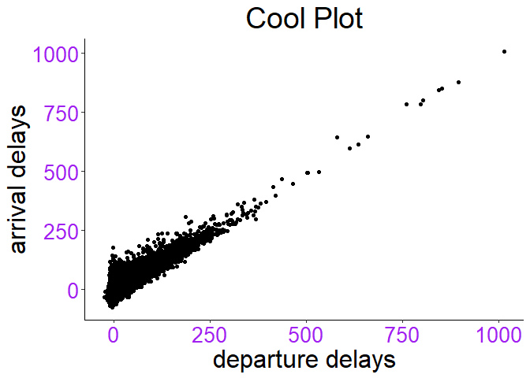

Some math AKA Homework 4
================

# Homework 4

Homework 4 writing script to do some simple math equations and learning
to use functions and make these functions a plot.

## Calculating the sum

assigning a value to an object and adding two objects together

``` r
a <- 3
b <- 2
print(a+b)
```

    ## [1] 5

### Sum function

``` r
sum(2,3)
```

    ## [1] 5

### **Flights**

The code for the library addition might still be in my script I have
issues correlating what I write in code with the result. This extra step
lets me see the code and see the result together. This next step will
add a plot to the code written thus far.

``` r
AA_flights <- filter(flights, carrier == "AA")
```

**flights is a data set inside the data frame nyc flight.**

``` r
test_name_plot <- ggplot(data= AA_flights, mapping = aes(x=dep_delay, y=arr_delay))+
  geom_point()
test_name_plot+
  labs(title = "Cool Plot", y= "arrival delays", x= "departure delays")+
  theme_classic()+
  theme(axis.title=element_text(size=24),
        axis.text=element_text(size=20,color="purple"), 
        plot.title = element_text(size = 28, hjust = .5) )
```

    ## Warning: Removed 782 rows containing missing values (geom_point).

<!-- -->
