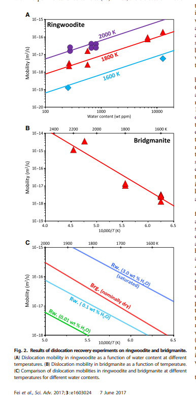
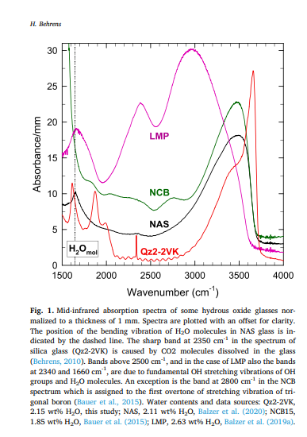

hmwk\_6\_succ\_unsucc\_plots
================

# Introduction

Presenting scientific data today there is a press to be correct and
taken seriously. Data is presented without drama or flair and eschew any
hint of entertainment. In the concerted effort to be solemnly relevant
we spend time in consideration of ink/data ratios which are lost in
monetary considerations as opposed to ease of communication of
information. Efficiency is correlational to how much information can go
on a plot to save on that precious ink and space. The audience seems
seldom considered as authors take Tufte’s conclusion, “Moreover, it is a
frequent mistake in thinking about statistical graphics to underestimate
the audience. Instead, why not assume that if you understand it, most
other readers will too?” (Tufte, P. 137) as a concrete interpretation
shoving on all manner of data into a plot, presuming that everyone
understands the experiment and process that went into it. Data
visualization can be complex/include a lot of data and I keep in mind
Tufte’s discussion in Chp 1 about Minard’s graph of Napoleon’s army
campaign against Russia. It is important that a graphic reveal and not
obscure your data and tell a story about the data. This story is not
sensational but one of facts because. The graphic should enhance without
conflating and help guide the reader to whatever conclusion you are
making about you research.

## The Successful Plot

A successful plot:

The data sets mapped into the image are the Bridgemanite and Ringwoodite
experiment results. The dislocation mobility, T, and water saturation
are all continuous. They are not factors, they could be any of the
values, and are not confined to a specific range.

The scale looks like a mean or average of the range of values. They
apply a line of best fit according to that mean in order to show how
most of the values fall along it and support their assessment that there
is a negatively correlational relationship between the two.

This a geom\_point() plot of dislocation mobility \[y axis\] of
Bridgemanite, and Ringwoodite as it becomes more hydrous and at
different temperatures \[temp and hydration in x axis\] (A,B) and then a
comparison dislocation mobility \[y-axis\] to Temperature \[x-axis\] as
a function of water saturation.

## The Unsuccessful Plot

**Overlapping data**: On the left side of the graph there is a
significant comparison of all of the lines to the standard (?) values of
bending vibration of water molecules in NAS glass. However NAS is not a
standard they are values from the current experiment. Since this is the
comparison that is vital perhaps a subset inlay of this section of the
graph blown up? Would a graph of the results on their own and another
one with the comparison have been more effective?

**Maximize data and ink ratio, within reason**: There is a lot of
information in the graph and there are caveats discussed in the words
below. These are all graphed in relation to water saturation but
saturation isn’t on the graph it is mentioned in the words.

**Axis labels**: Are not in proportion to the graph. Making them bigger
will ease the reading.

**Misc**: There is changes in absorption spectra on the left side that
isn’t discussed.
