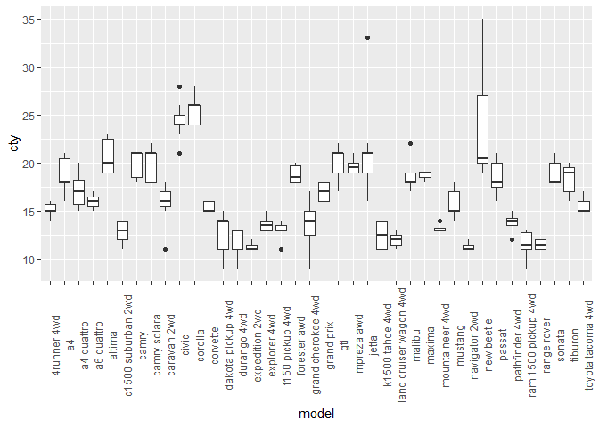

new\_hmwk\_3\_v\_2
================

### Research Question

I am interested in how city mileage varies between model types. Do some
models of cars get better gas mileage than others in the city?

``` r
ggplot(data=mpg, mapping = aes(x=model, y=cty))+
  geom_boxplot()+
  theme(axis.text.x= element_text(angle = 90))
```

<!-- -->

### Conclusion

larger vehicles like the SUV’s and Trucks had terrible gas mileage. Cars
like the new beetle hava a larger range of gas mileage compared to the
Ford F150 and Range Rover had a much narrower range.
