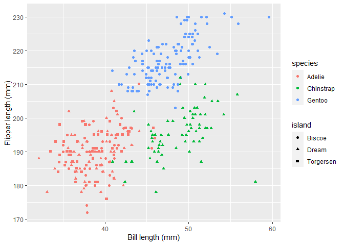
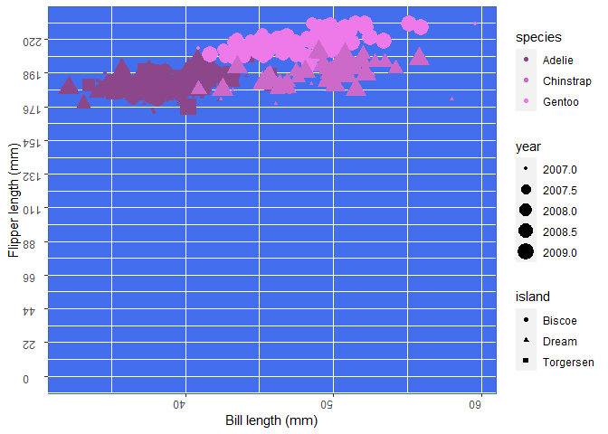

Homework\_7\_Bad\_plot
================

``` r
library(palmerpenguins)
```

# How it Should Look

``` r
ggplot(penguins, aes(x = bill_length_mm, y = flipper_length_mm, colour = species, shape = island)) +
  geom_point() +
  labs(x = "Bill length (mm)", y = "Flipper length (mm)")
```

    ## Warning: Removed 2 rows containing missing values (geom_point).

<!-- -->

# How it Should Not Look

``` r
ggplot(penguins, aes(x = bill_length_mm, y = flipper_length_mm, colour = species, shape = island, size=year)) +
  geom_point() +
  labs(x = "Bill length (mm)", y = "Flipper length (mm)")+
  scale_y_continuous(limits=c(0,230),
                     breaks=seq(from=0,to=230,by=22))+
  scale_color_manual(values=c("orchid4","orchid3","orchid2"))+
  theme(panel.background = element_rect(color="royalblue3",fill="royalblue2"),axis.text = element_text(hjust=0,vjust=0,angle=180))
```

    ## Warning: Removed 3 rows containing missing values (geom_point).

<!-- -->
