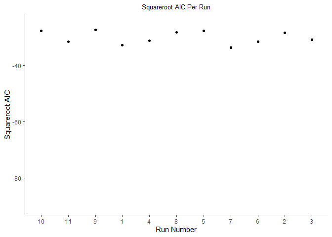
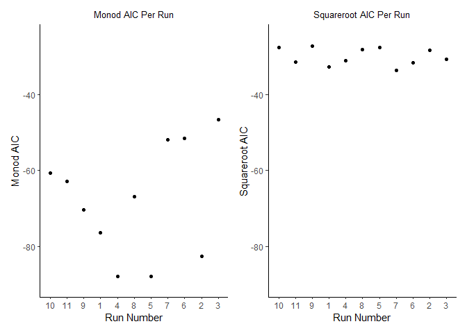

Homework\_8
================

# Start with what you know.

This was a little confusing until you did it with the penguins. I think
the DNase and biology stuff was confusing.

You can compare things like how you did the bill length and species in
the penguin exercises.

models\_penguins &lt;- penguins %&gt;% group\_by(species) %&gt;% nest()
%&gt;% mutate(models = map(data, \~lm(bill\_length\_mm \~ body\_mass\_g,
data = .x)), coefficients = map(models, \~tidy(.x)), slope =
map\_dbl(coefficients, \~pull(.x, estimate)\[2\])) %&gt;%
arrange(desc(slope))

## Notes

Group\_by and Filter\_by are confusing. Filter when you want to exclude
something.

group\_by I have a structure in my data set and I want r to know about
it because i am going to do something to each group in the data.

The thing I am going to do to my data I want to do to the group NOT the
whole data set.

``` r
diamonds_start <- diamonds %>% 
  group_by(color) %>% 
  nest() %>% 
  mutate(models = map(data, ~lm( price~ carat, data = .x)),
         coefficients = map(models, ~tidy(.x)),
         slope = map_dbl(coefficients, ~pull(.x, estimate)[2])) %>% 
  arrange(desc(slope))
diamonds_start
```

    ## # A tibble: 7 x 5
    ## # Groups:   color [7]
    ##   color data                  models coefficients     slope
    ##   <ord> <list>                <list> <list>           <dbl>
    ## 1 F     <tibble [9,542 x 9]>  <lm>   <tibble [2 x 5]> 8677.
    ## 2 G     <tibble [11,292 x 9]> <lm>   <tibble [2 x 5]> 8525.
    ## 3 D     <tibble [6,775 x 9]>  <lm>   <tibble [2 x 5]> 8408.
    ## 4 E     <tibble [9,797 x 9]>  <lm>   <tibble [2 x 5]> 8296.
    ## 5 I     <tibble [5,422 x 9]>  <lm>   <tibble [2 x 5]> 7761.
    ## 6 H     <tibble [8,304 x 9]>  <lm>   <tibble [2 x 5]> 7619.
    ## 7 J     <tibble [2,808 x 9]>  <lm>   <tibble [2 x 5]> 7094.

## The above code generates a table

A table to which I have added (mutated) the column slope in descending
order.

# Non linear

``` r
library(nls2)
library(broom)
library(tidyverse)

monod_mod <- formula(density ~ (conc*dmax)/(conc + k))

sqrt_mod <- formula(density ~ beta_1 * sqrt(conc) + beta_0)
single_sqrt_model <- nls2(sqrt_mod,
data = DNase,
start = list(beta_1 = 0.5, beta_0 = 0.1)) 

compare_models <- DNase %>%
  group_by(Run) %>%
  nest() %>%
  mutate(sqrt_mod = map(data, ~ nls2(
    sqrt_mod,
    data = .,
    start = list(beta_1 = 0.5, beta_0 = 0.1)
  )),
  monod_mod = map(data,  ~ nls2(
    monod_mod, data = ., start = list(dmax = .3, k = .4)
  )), 
  sqrt_aic= map_dbl(sqrt_mod,~glance(.)$AIC), 
  monod_aic=map_dbl(monod_mod,~glance(.)$AIC))
compare_models
```

    ## # A tibble: 11 x 6
    ## # Groups:   Run [11]
    ##    Run   data              sqrt_mod monod_mod sqrt_aic monod_aic
    ##    <ord> <list>            <list>   <list>       <dbl>     <dbl>
    ##  1 1     <tibble [16 x 2]> <nls>    <nls>        -32.7     -76.4
    ##  2 2     <tibble [16 x 2]> <nls>    <nls>        -28.5     -82.6
    ##  3 3     <tibble [16 x 2]> <nls>    <nls>        -30.9     -46.7
    ##  4 4     <tibble [16 x 2]> <nls>    <nls>        -31.2     -87.9
    ##  5 5     <tibble [16 x 2]> <nls>    <nls>        -27.7     -87.9
    ##  6 6     <tibble [16 x 2]> <nls>    <nls>        -31.6     -51.6
    ##  7 7     <tibble [16 x 2]> <nls>    <nls>        -33.7     -51.9
    ##  8 8     <tibble [16 x 2]> <nls>    <nls>        -28.2     -66.8
    ##  9 9     <tibble [16 x 2]> <nls>    <nls>        -27.3     -70.3
    ## 10 10    <tibble [16 x 2]> <nls>    <nls>        -27.7     -60.7
    ## 11 11    <tibble [16 x 2]> <nls>    <nls>        -31.6     -62.8

# Build the Plots for comparison

``` r
plot_monod_model <- ggplot(compare_models,aes(x=Run, y=monod_aic))+
  geom_point()+
  theme_classic()+
  labs(title="Monod AIC Per Run", y= "Monod AIC", x="Run Number")+
  theme(plot.title = element_text(size = 10, hjust = .5))
plot_monod_model
```

<!-- -->

``` r
  plot_squareroot_model <- ggplot(compare_models,aes(x=Run, y=sqrt_aic))+
  geom_point()+
  theme_classic()+
  labs(title="Squareroot AIC Per Run", y= "Squareroot AIC", x="Run Number")+
  theme(plot.title = element_text(size = 10, hjust = .5))
plot_squareroot_model
```

<!-- -->

``` r
plot_monod_model+plot_squareroot_model
```

<!-- -->

Monod Model appears to have the most negative values and is the best
model to use. Runs 4 and 5 were particularly good and we should attempt
to replicate them.
