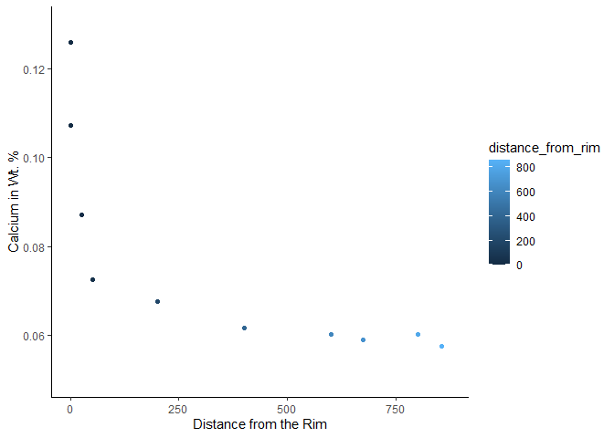

Kil\_wendlandt\_Ca\_Ol\_tbl
================

## Ca in Olivine

1.  Snipped image and uploaded to Adobe Illustrator and locked layer.

2.  Using the axes as straight line templates created a series of
    vertical and horizontal lines.

3.  Using the symbols for each point ran the lines through 2 corners to
    the axis

``` r
library(readr)
tbl_Ca_ol_kil_wendlandt <- read_csv("C:/Users/taraw/OneDrive/Desktop/tbl_Ca_ol_kil_wendlandt.csv")
```

    ## Rows: 10 Columns: 4

    ## -- Column specification --------------------------------------------------------
    ## Delimiter: ","
    ## dbl (4): Location and distance in μm, ppm of Ca, convert, Convert ppm to wt %

    ## 
    ## i Use `spec()` to retrieve the full column specification for this data.
    ## i Specify the column types or set `show_col_types = FALSE` to quiet this message.

``` r
names(tbl_Ca_ol_kil_wendlandt) <- c("distance_from_rim", "ppm_of_Ca", "convert_log", "wt_perc_Ca")
```

theme\_classic by itself removes the grey tiles

``` r
kil_wend_data_plot <- ggplot(data=tbl_Ca_ol_kil_wendlandt, mapping=aes(x=distance_from_rim, y=wt_perc_Ca, color=distance_from_rim))+
  geom_point()+
  labs(x="Distance from the Rim", y="Calcium in Wt. %")+
  annotate("text",x=0, y=0.03, label= "rim")+
  annotate("text", x=825, y=0.03, label= "core")+
  coord_cartesian(clip="off", xlim = c(0,875), ylim= c(0.05,0.13))+
  theme_classic()
kil_wend_data_plot
```

<!-- -->
